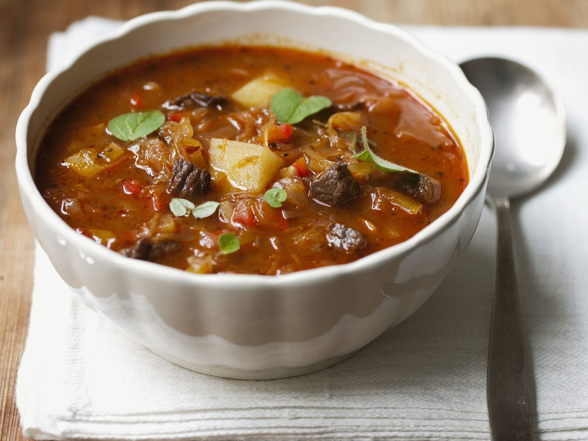
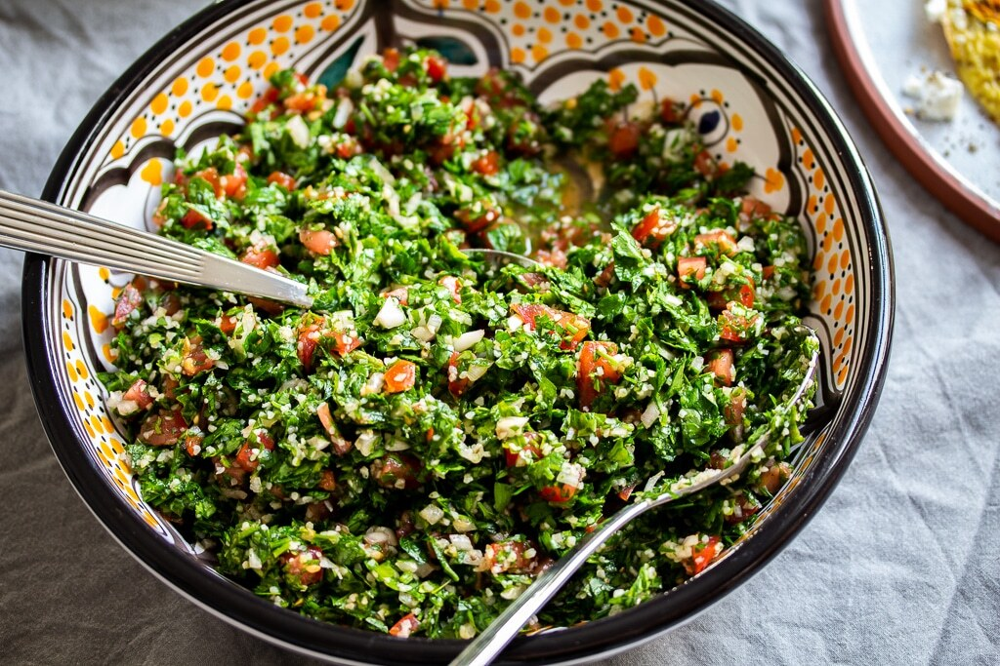

# cookbook
Das offizielle CrazyCoders Kochbuch ist eine Ansammlung von den Lieblingsrezepten der Schüler der Klasse FbW-WD21-D02-1 "CrazyCoders"

## Inhalt

1. [Ahmads Lieblingsrezepte](#ahmads-lieblingsrezepte)
2. [Alis Lieblingsrezepte](#alis-lieblingsrezepte)
3. [Camilas Lieblingsrezepte](#camilas-lieblingsrezepte)
4. [Farihas Lieblingsrezepte](#farihas-lieblingsrezepte)
5. [Hamids Lieblingsrezepte](#hamid-lieblingsrezepte)
6. [Houmans Lieblingsrezepte](#houmans-lieblingsrzepte)
7. [Lászlós Lieblingsrezepte](#laszlos-lieblingsrezepte)
8. [Mahmuts Lieblingsrezepte](#mahmuts-lieblingsrezepte)
9. [Mariannas Lieblingsrezepte](#mariannas-lieblingsrezepte)
10. [Mustaphas Lieblingsrezepte](#mustaphas-lieblingsrezepte)
11. [Obadahs Lieblingsrezepte](#obadahs-lieblingsrezepte)
12. [Przemyslaws Lieblingsrezepte](#przemyslaws-lieblingsrezepte)
13. [Saeeds Lieblingsrezepte](#saeeds-lieblingsrezepte)
14. [Sidars Lieblingsrezepte](#sidars-lieblingsrezepte)
15. [Soonams Lieblingsrezepte](#soonams-lieblingsrezepte)
16. [Tanjus Lieblingsrezepte]

---

# Ahmads Lieblingsrezepte

# Pasta in cremiger Puten-Champignon-Sauce

## Zutaten
```
Putenbrustfilets                                                                      600 g 
Champignons, weiß                                                                     800 g 
Basilikum, frisch                                                                       30g
Salz
Spaghetti                                                                              500 g 
Öl                                                                                      3 EL
Pfeffer, schwarz
Balsamicoessig, hell                                                                    4 EL 
Frischkäse, natur                                                                       100 g 
 ```
[](http://www.youtube.com/watch?v=L4GhsPvgLBs)

1. Pilze ggf. mit Küchenkrepp säubern und sechsteln. Basilikum waschen, trocken schütteln, Blätter von den Stielen zupfen und fein schneiden. Pute waschen, trocken tupfen und grob würfeln.  


2. In einem Topf ca. 5 l Salzwasser aufkochen. Pasta im siedenden Salzwasser ca. 9 Min. al dente garen. 


3. In einer Pfanne 1 EL Öl auf hoher Stufe erhitzen und Putenwürfel ca. 4 Min. rundherum anbraten. Danach pfeffern und auf einem Teller beiseitestellen. 2 EL Öl im Bratensatz in der Pfanne auf hoher Stufe erhitzen und Pilze darin ca. 2-3 Min. scharf anbraten. Danach mit 2 EL Balsamico ablöschen und mit Salz und Pfeffer würzen. 


4. Spaghetti im Sieb abgießen und Kochwasser dabei auffangen. 1-2 Kellen Kochwasser, Putenwürfel, Frischkäse und die Hälfte des Basilikums in die Pfanne geben, alles vermengen und mit Salz und Pfeffer abschmecken. Spaghetti dazugeben und mit der Sauce vermengen. Spaghetti in cremiger Puten-Pilz-Sauce auf Tellern anrichten, restliches Basilikum darüberstreuen und servieren. 


Guten Appetit! 

***

# Tagliatelle mit Spinat und Hähnchen
## Zutaten 

```
Hähnchenbrustfilets                                                                   600 g
Zwiebeln, rot                                                                         1 Stk
Öl                                                                                     3 EL
Salz
Schlagsahne                                                                           150 ml
Tagliatelle, frisch                                                                    500 g 
Olivenöl                                                                                1 EL 
Blattspinat                                                                            300 g 
Pfeffer, schwarz
```
[](http://www.youtube.com/watch?v=pbPPdheBd1c&t=17s)

1. In einem Topf ca. 4 l Salzwasser zugedeckt aufkochen. Hähnchen waschen, trocken tupfen, ggf. von Sehnen befreien und in ca. 3-4 cm große Stücke Fleisch schneiden. Zwiebel halbieren, schälen und in dünne Streifen schneiden.  


2. In einer Pfanne 2 EL Öl auf hoher Stufe erhitzen und Hähnchen darin ca. 3-4 Min. scharf anbraten. Anschließend Hähnchen auf einem Teller beiseitelegen. Pfanne nicht säubern, 1 EL Öl zugeben und Zwiebeln darin auf mittlerer Stufe ca. 3 Min. anschwitzen. Mit Sahne ablöschen, aufkochen und auf mittlerer Stufe ca. 3-4 Min. einköcheln, sodass eine sämige Soße entsteht.  


3. Inzwischen Tagliatelle im kochenden Salzwasser ca. 4 Min. bissfest garen. Anschließend die Nudeln in einem Sieb abgießen. Tagliatelle nicht abschrecken, sondern mit 1 EL Olivenöl mischen und beiseitestellen. 


4. Spinat waschen und trocken schleudern. Spinat zur Zwiebel-Sahne-Mischung geben und unter Rühren ca. 1-2 Min. zusammenfallen lassen. Hähnchen ebenfalls wieder zugeben und ca. 1-2 Min. warm ziehen lassen. Alles würzig mit Salz und Pfeffer abschmecken. 


5. In der Pfanne Tagliatelle, Spinat-Sahnesoße und das Hähnchen vermengen und ggf. nachwürzen. Tagliatelle mit Hähnchen und Spinat-Sahnesoße in tiefen Tellern anrichten und servieren. 


Guten Appetit!


***

# Alis Lieblingsrezepte

## Alis Lieblingsrezept aus der Heimat 

## MAKARONNI GERICHT


## ZUTATEN:

1. *15 g*	Proteinpulver **(Whey Vanille)**
2. _20 g	Erythrit **(Zuckerersatz)** (Xucker light)_
3. 120 ml	Hafermilch **(Haferdrink)**
4. 3 g	    Backpulver
5. 1 EL	    Chiasamen
6. 50 g	    Reismehl
7. Ei(er)
8. _Banane_

## ZUBEREITUNG:

**Alle Zutaten in einem Standmixer vermengen.**

> Öl in einer Pfanne erhitzen und jeweils zwei Esslöffel Teig für einen Pancake bei mittlerer Hitze braten.

>  **Tipps:** Jede andere Pflanzenmilch ist möglich. Das Reismehl kann z. B. durch Haferflockenmehl ersetzt werden.

**Nährwerte:**
- 153 g Kohlenhydrate
- 16 g Fett
- 37 g Eiweiß

## Alis Lieblingsrezept aus Deutschland

## Entrecôte-Steak mit Rote-Bete-Sala


> Für ein gutes Stück Fleisch muss man nicht lange in der Küche stehen - das zarte Entrecôte-Steak mit Rote-Bete-Salat beweist es. Dazu servieren wir Rucola und Walnüsse.

### Zutaten:

- 1½ EL Olivenöl
- (Entrecôte-Steaks à 220 g)
- Salz
- Pfeffer (frisch gemahlen)
- 125 Gramm Rote Bete (vorgekocht, aus dem Vakuumpack)
- ½ Knoblauchzehe
- 1½ EL Balsamessig
- Zucker
- 25 Gramm Rucola (Rauke)
- 1 EL Walnüsse (gemahlen)

### Zubereitung:

> Den Backofen auf 150 Grad, Umluft nicht empfehlenswert, Gas Stufe 1 vorheizen.
 1 EL Öl in einer Pfanne erhitzen. Steaks trocken tupfen, salzen, pfeffern und je Seite etwa ½ Minute scharf anbraten. Auf einem Blech im Ofen 8-10 Minuten fertig garen.
 Rote Bete abtropfen lassen und in Spalten schneiden. Knoblauch andrücken und schälen. 1-2 EL Öl in einer Pfanne erhitzen, Rote Bete und Knoblauch darin 3 Minuten braten. Essig und 2 Prisen Zucker zufügen, zugedeckt etwa 2 Minuten karamellisieren lassen.
 Steaks herausnehmen, fest in Backpapier wickeln, 5 Minuten ruhen lassen. Rauke verlesen, abspülen, trocknen. Mit Walnüssen, Roter Bete, restlichem Öl, Salz und Pfeffer mischen. Zu den Steaks servieren.

###  GUTEN APPETITE

***

# Camilas Lieblingsrezepte

## Camilas Lieblingsrezept aus der Heimat

## Käsebällchen (Aus Brasilien)

Auf Portugiesisch sagt man **Pão de queijo** *(etwas wie Pawn di Keisho)*


```
Arbeitszeit ca. 30 Minuten
Ruhezeit ca. 1 Stunde 
Koch-/Backzeit ca. 25 Minuten
Gesamtzeit ca. 1 Stunde 55 Minuten
```

### ZUTATEN:

- **1 kg** 	Tapioka (Mehl), oder, falls zu bekommen, Polvilho azedo
- **200 ml** 	Öl
- **500 g**	Käse, gerieben (Gemisch aus Parmesan und Gouda, mittelalt)
- **3** 	Ei(er), Größe M
- **400 ml** 	Milch
- **125 ml** 	Wasser
- **1 EL** 	Salz, gehäufter EL

### ZUBEREITUNG:

1. Wasser und Milch zusammen mit dem Öl und dem Salz in einem Topf zum Kochen bringen;
2. Den Topf vom Herd nehmen und das Tapiokamehl nach und dazugeben und unterrühren; 
3. Die 3 Eier verquirlen und in den Teig gleiten lassen; 
4. Alles zu einem geschmeidigen Teig verarbeiten.
Zum Schluss den geriebenen Käse zufügen (man kann auch türkischen Kefalotery-Käse, oder Manchego oder Pecorino verwenden) und den Teig jetzt am besten mit den Händen bearbeiten und alles richtig verkneten; 
5. Diese mit etwas Abstand auf ein mit Backpapier ausgelegtes Backblech legen und für 20 - 25 Minuten auf der mittleren Schiene bei 180 - 200°C Umluft goldgelb backen.
Nach Ende der Backzeit sind sie von außen leicht knusprig und von innen herrlich weich. Diese besondere Konsistenz ist genau richtig.

```
Guten Appetit!
```
## Camilas Lieblingsrezept aus Deutschland

# Hamburger Labskaus

#### (aus Hamburg, Deutschland)


_Arbeitszeit ca. 25 Minuten_

_Koch-/Backzeit ca. 25 Minuten_

_Gesamtzeit ca. 50 Minuten_

### ZUTATEN:

- 1 Dose        `Corned Beef`
- 750 g          `Kartoffel(n), geschält`
- 3             `Gewürzgurke(n)`
- 2             `Zwiebel(n)`
- 4             `Eier`
- 4             `Matjesfilets, Bismarckheringe oder Rollmöpse`
- etwas:	
        Rote Bete,
        Salz und Pfeffer,
        Piment, gemahlen,
        Margarine zum Braten,
        Gurkenflüssigkeit

### ZUBEREITUNG:

1. Die Kartoffeln als Salzkartoffeln kochen;

2. In der Zwischenzeit die klein gewürfelten Zwiebeln in etwas Fett andünsten, bis sie blond sind; Das klein geschnittene Corned Beef zufügen und mit Deckel etwa 3 Minuten dünsten; Dann die gewürfelten Gewürzgurken mit etwas vom Gurkensud zufügen; Mit Salz, Pfeffer und Piment herzhaft abschmecken; Wenn gewünscht, eventuell noch etwas gewürfelte Rote Beete zugeben. Alles etwa 10 Minuten leicht köcheln lassen;

3. Die fertig gegarten Kartoffeln etwas stampfen, jedoch nicht so fein wie für Püree! Den Corned Beef Mix unterrühren. Wenn die Mischung zu fest ist, noch etwas Gurkenwasser unterrühren;

4. Auf Teller füllen. Mit **Spiegelei** und nach Geschmack mit **Matjes, Bismarckhering** oder **Rollmops** servieren.

### VIDEO:

[](http://www.youtube.com/watch?v=_4nrbwXphsc)

```Guten Appetite!``` 

***

# Farihas Lieblingsrezepte

## Farihas Lieblingsrezept aus der Heimat

## Kabuli Palau


**Das Rezept**

**_Zutaten für 5 Personen_**

- Basmati-Reis        500 g
- Lammkeule           1 kg
- Zwiebeln            200 g
- Kardamom gemahlen   0,5 TL 
- Pfeffer             0,5 TL
- Garam-Masala        1 TL
- Salz                2 TL
- Wasser              750 ml
- Öl                  120 ml
- Rosinen             100 g
- Karotten            500 g
- Mandelstifte        100 g
- Zucker              2 TL

**_Zubereitung_ (Gesamtzeit 2 Std.)**

1. Reis mit kaltem Wasser bedeckt 1-2 Stunden quellen lassen. Fleisch parieren und in ca. 5 cm große Würfel schneiden. Kardamom, Pfeffer, Garam Masala und Salz in dem warmen Wasser verrühren.
2. Die Zwiebeln in der Hälfte des Öles unter Rühren anbraten. Dann das Fleisch dazugeben und rundum kräftig anbraten.
3. Mit der Gewürzmischung ablöschen, aufkochen und bei mittlerer Hitze eine Stunde zugedeckt garen. Dabei immer wieder abschäumen.
4. Die Karotten putzen, längs in dünne Scheiben, dann in schmale Streifen schneiden.
5. Das restliche Öl erhitzen, dann die Rosinen unter ständigem Rühren darin so lange erhitzen, bis sie prall und rund geworden sind. Die Rosinen herausheben und auf einen großen Teller geben.
6. Im selben Öl die Karottenstreifen mit dem Zucker unter Rühren 3-4 Minuten anbraten, herausnehmen und ebenfalls auf den Teller geben. Zuletzt die Mandeln kurz rösten und auf den Teller geben.
7. Das Fleisch aus der Brühe heben und zugedeckt warmhalten. Die Brühe durch ein feines Sieb in einen großen Topf gießen und aufkochen.
8. Den abgetropften Reis hineingeben und bei mittlerer Hitze zugedeckt so lange garen, bis die Brühe aufgesogen ist (der Reis fängt dann an leise zu knistern).
9. Mit dem Stiel eines Kochlöffels mehrere "Kamine" in den Reis drücken, so dass der Dampf entweichen kann.
10. Das Fleisch, die Rosinen, die Karotten und die Mandelmischung nebeneinander auf den Reis setzen.
11. Topfdeckel mit einem Küchentuch umwickeln, Topf damit zudecken. Bei sehr niedriger Temperatur weitere 20-30 Minuten erhitzen.
12. Sowohl die Rosinen, als auch Karotten und die Mandelmischung aus dem Topf heben. Die Fleischstücke auf eine große, vorgewärmte Servierplatte legen und mit dem Reis bedecken.
13. Die Rosinen, die Mandelmischung und die Karottenstreifen darüber streuen und servieren.

---

_Hier noch ein Video wie man Kabuli Palau kocht._

[](http://www.youtube.com/watch?v=UqK_ox7FF00)

### _Guten Apetit!_

Auf afghanisch: _Ishtiyahe khub!_ 

## Farihas Lieblingsrezept aus Deutschland

## Klassische Kohlrouladen


---

**Das Rezept**

**_Zutaten für 6 Personen_**

- Weißkohl (ca. 1,2 kg)               1
- Kümmelsaat Salz                     2 EL
- Brötchen (altbacken, ca. 40 g)      1
- Zwiebel (ca. 90 g)                  1
- Hackfleisch                         500 g
- Ei (Kl. M)                          1
- Kümmel (gemahlen)                   1 TL
- Pfeffer                             1 TL
- Öl                                  8 EL
- Tomatenmark                         1 EL
- Speisestärke                        3 EL

***

**_Zubereitung_ (Gesamtzeit 4 Std.)**

1. Vom Kohl die äußeren Blätter entfernen, Strunk keilförmig herausschneiden. Kohl und Kümmelsaat in einen großen Topf mit reichlich Salzwasser geben, zugedeckt aufkochen und bei milder Hitze ca. 20 Minuten ziehen lassen. Geben Sie mindestens 3 Liter Wasser zum Kohl, so ist er beim Garziehen komplett bedeckt, und es bleibt genügend Wasser für den Saucenansatz. Kohl mit einer Schaumkelle aus dem Wasser heben und ca. 10 Minuten abkühlen lassen. Kochwasser durch ein Sieb gießen, auffangen und beiseitestellen.
2. nzwischen für die Füllung Brötchen in Wasser einweichen, bis es komplett vollgesogen ist. Zwiebel in sehr feine Würfel schneiden. Brötchen gut ausdrücken. Hackfleisch mit Brötchen, Zwiebeln, Ei und gemahlenem Kümmel verkneten, mit Salz und Pfeffer würzen, beiseitestellen.
3. Vom Kohl vorsichtig 12 große Blätter ablösen, auf einem Küchentuch abtropfen lassen und mit Küchenpapier trocken tupfen. Anhaftende Kümmelsaat vorsichtig entfernen. Dicke Mittelrippen aus den Blättern herausschneiden. Je 2 Blätter leicht überlappend aneinanderlegen. Ein Blatt sollte mit dem oberen Rand 2-3 cm breit auf dem unteren Rand des anderen Blattes liegen, damit sich die Füllung gut darin einrollen lässt. Restlichen Kohl beiseitelegen.
4. Hackmasse in 6 Portionen teilen, je 1 Portion mittig aufs untere Drittel der Kohlblätter setzen, dabei seitlich jeweils etwas Platz lassen. Kohl von unten über die Füllung klappen, dann die Seiten über die Füllung klappen und die Blätter von unten aufrollen. Kohlrouladen über Kreuz mit Küchengarn zusammenbinden.
5. 3-4 El Öl in einer großen Pfanne erhitzen, Kohlrouladen darin pro Seite je 4-5 Minuten bei mittlerer Hitze braun anbraten. Rouladen aus der Pfanne nehmen und in einen Bräter legen. Bratensatz in der Pfanne mit 500 ml Kochwasser vom Kohl ablöschen, 2 Minuten bei milder Hitze kochen lassen und zu den Rouladen in die Auflaufform gießen. Es sollte genügend Flüssigkeit in der Auflaufform sein, damit die Rouladen während des Garens nicht trocken werden. Kohlrouladen im vorgeheizten Backofen bei 180 Grad (Gas 2-3, Umluft 160) 2-2:30 Stunden schmoren, dabei alle 30 Minuten wenden.
6.  Für die Sauce den restlichen Kohl in ca. 3 cm große Stücke schneiden, in 3-4 El Öl dunkelbraun anbraten und mit Pfeffer würzen. Tomatenmark zugeben und 2-3 Minuten mitbraten. Mit 1,5 l Kochwasser vom Kohl auffüllen und ca. 1 Stunde bei milder bis mittlerer Hitze einkochen lassen. (Auf die Weise ergibt sich ca. 1 l Saucenansatz.)
7. Kohlrouladen aus der Auflaufform nehmen und auf einem Teller beiseitestellen. Bratenfond aus der Auflaufform zum Saucenansatz gießen. Saucenansatz durch ein Sieb in einen Topf gießen, durchdrücken und gut abtropfen lassen. Sauce aufkochen und mit in etwas kaltem Wasser angerührter Stärke abbinden. Kohlrouladen in der Sauce nochmals erwärmen, dann auf Tellern verteilen, 3-4 El Sauce darübergeben. Dazu passen Petersilienkartoffeln.

---

_Hier noch ein Video wie man die Kohlroueladen macht._

[](http://www.youtube.com/watch?v=0EzttZ4vM10)

### _Guten Apetit!_

***

# Hamids Lieblingsrezepte

## Hamids Lieblingsrezept aus der Heimat

# Kabab koobideh
## Preparation and cooking


>Lamb or beef (precisely 20% fat, 80% meat) is minced twice for finerconsistency. Salt, black pepper, very finely grated onion and optionally one egg yolk per pound of meat is added. All ingredients are mixed, covered, and left to marinate in the refrigerator for at least one hour or overnight.

>Kabab koobideh is grilled on wide, flat skewers, traditionally over hot coals, and is served with chelow (Iranian plain white rice with oil, salt and saffron), accompanied by grilled tomatoes and onions. Sumac is usually served as a tableside garnishing spice.

>Chicken kabab koobideh is made using chives or green onions, parsley, salt and pepper—no turmeric and no sumac. It is served over baghali polo (dill and broad bean rice pilaf).

## In diesem Video sehen Sie, wie man Kebab zubereitet

[](http://www.youtube.com/watch?v=nFZMZChXL3w)

## Hamids Lieblingsrezept aus Deutschland

# Currywurst


>ist ein Gericht aus Brat- oder anderer Brühwurst, die ganz oder geschnitten mit einer tomatenhaltigen Sauce und Currypulver oder mit einem Curry-Ketchup serviert wird. Sie wird der Deutschen Küche zugerechnet. Bei den Würsten handelt es sich meist um feine, vorgegarte Brühwürste mit oder ohne Darm. Serviert wird das seit der Nachkriegszeit bekannte Gericht vor allem in der Imbissgastronomie. Es ist außerdem ein beliebtes Angebot in deutschen Betriebskantinen[1][2] und auch als Fertigkericht für Privathaushalte erhältlich.

>Currywurst (in Kombination mit Pommes frites) ist im Jahr 2020 zum 28. Mal in Folge beliebtestes Kantinenessen in Deutschland,[4] wurde aber 2021 durch Spaghetti Bolognese abgelöst.[5]

## In diesem Video sehen Sie, TOP 15 CURRYWURSTE IN BERLIN! DER GROßE TEST

[](http://www.youtube.com/watch?v=jz1WqZ8lBYk)

***

## Houmans Lieblingsrezept aus der Heimat

# Kabab Kubideh | Rezept


Kabab Kubideh - persischer Hackfleischspieß
Zutaten (für 4 Portionen):

- 1/2 kg Lammfaschiertes
- 1/2 kg Rindfaschiertes
- 3 Zwiebel
- 1 TL Safran
- 2 TL Sumach
- 2 TL Kurkuma
- Salz, Pfeffer
- Kabab-Spieße (aus Metall mit flacher Klinge)

### Kabab Kubideh: der Klassiker unter den persischen Grillspießen

Kabab gehört zu den typischen Gerichten des Iran, hat aber mit dem bekannten türkischen Drehspieß gar nichts gemein. In der persischen Variante wird das Fleisch auf dünne flache Metallspieße gesteckt und am Holzkohlengrill zubereitet. Entscheidend für die Qualität ist die Qualität und Zartheit des Fleisches, gerade die persische Küche lebt von der Güte ihrer Zutaten. Die Feinheit der Rezeptkomposition und die Gewürzwahl ist darauf abgestimmt. Die typischen langen, abgeflachten Spieße und die Zubereitung am Holzkohlengrill geben dem persischen Kabab seinen einzigartigen, unverwechselbaren Geschmack.

***

# Houmans Lieblingsrezepte

## Houmans Lieblingsrezept aus Deutschland

# Gulaschsuppe | Rezept



Gulaschsuppe nach ungarischer Art
Zutaten (für 4 Portionen):

- 600g Rindfleisch küchenfertig, aus der Schulter
- 400g festkochende Kartoffeln
- 300g Zwiebeln
- 2    Knoblauchzehen
- 2    rote Paprikaschoten
- 1    rote Chilischote
- 2 EL Butter
- 2 EL edelsüßes Paprikapulver
- 3 EL Tomatenmark
- 1⅓l  Rindfleischbrühe
- 1    Lorbeerblatt
- 1 TL Kümmelsamen
- 3    Pfefferkörner 
       Salz 
       Pfeffer aus der Mühle
- 2    Stiele Majoran

### Zubereitungsschritte

- 1 Fleisch waschen, trocken tupfen und in mundgerechte Stücke schneiden. Kartoffeln schälen, waschen und ebenfalls in mundgerechte Stücke schneiden.
- 2 Zwiebeln und Knoblauch schälen, Zwiebel in feine Streifen schneiden und Knoblauch fein hacken.
- 3 Paprikaschote halbieren, entkernen, waschen und in Würfel schneiden. Chilischote längs halbieren, entkernen, waschen und hacken.
- 4 In einem Topf Butter erhitzen und Fleisch portionsweise rundherum bei starker Hitze anbraten. Mit Paprikapulver würzen, herausnehmen und beiseitestellen.
- 5 Zwiebeln, Knoblauch und Chili im Bratenfett anbraten, Tomatenmark einrühren, mit Fleischbrühe ablöschen. Fleisch wieder einlegen und bei mittlerer Hitze etwa 1 1/2 Stunden schmoren lassen.
- 6 Zwischenzeitlich Lorbeerblatt, Kümmelsamen und Pfefferkörner in ein Teefilter geben. Nach etwa 1 Stunde zusammen mit Paprika und Kartoffeln zugeben und mitgaren.
- 7 Die ungarische Gulaschsuppe mit Salz und Pfeffer abschmecken, Gewürze entfernen und die Suppe in vorgewärmten Schälchen anrichten. Majoran waschen, trocken schütteln, Blättchen abzupfen und Suppe damit bestreut servieren.

###  Bon Appétit

***

# Laszlos Lieblingsrezepte

## Lászlós Lieblingsrezept aus der Heimat

## Ungarisches Bohnengulasch


## Zutaten für 6 Personen

- 1 kg Schulter von Schwein
- 200 g geräucherter Speck
- 1 Dose weiße Bohnen, groß (800 g)
- 1 Dose rote Kidney Bohnen, groß (800g)
- 150 ml Speiseöl
- 3 Zwiebeln 
- 3 Zehen Knoblauch
- 3 Tomaten
- 2 grüne Paprika
- 1/2 Sellerie
- 3 Karotten
- 1 EL Thymian, getrocknet
- 2 EL Paprikapulver (rot)
- 2TL Pfeffer
- 2 Lorbeerblätter 
- Salz

### Zubereitung 

Für das ungarische Bohnengulasch (Babgulyás im Original) bereiten wir uns zuerst den Speck und die Gemüse für, die wir alles am entweder schälen - putzen oder von der Schwarte befreien und anschließend in kleine Würfel schneiden. Auch das Schulterfleisch vom Schwein schneiden wir in mundgerechte Quader.

Und schon kann es auch losgehen und dazu stellen wir einen Schmortopf  auf den Herd, erhitzen diesen, geben das Öl samt Speckwürfeln hinein und lassen diese kurz aus.

Im nächsten Schritt geben wir Knoblauch & Zwiebel hinzu und rösten für gut 10 Minuten weiter. Dabei immer wieder umrühren.

Danach das Schweinefleisch zu den Zwiebeln, die nun ganz leicht Farbe genommen haben, geben und braten das Ganze für weitere ~ 15 Minuten weiter. Umrühren nicht vergessen. 
 
Jetzt wird es Zeit für die in Würfelchen geschnittenen grünen Paprika. Diese geben wir nun hinein und garen nun nochmal für 5 Minuten. 

Nun wird es Zeit, dass wir die Würfel aus Tomate - Sellerie, Karotte & Lorbeer ebenfalls zum Gulaschansatz geben und abermals für gut 10 Minuten angehen lassen. 

Nach der ganzen Rösterei und Rührerei rühren wir nun das gute Paprikapulver, den Thymian und den Pfeffer unter und gießen sofort mit 2 Liter Wasser auf, denn so kann uns das Pulver nicht anbrennen und bitter werden. Nun solange köcheln bis das Fleisch weich ist. 

Ist das geschehen, so geben wir nun die gut abgetropften weißen & roten Bohnen zu den restlichen Zutaten und lassen diese nun für 10 - 15 Minuten, unter leichtem Köcheln und gelegentlichem Umrühren, final mitköcheln. 

Durch das Rühren und die austretende Stärke der Bohnen dickt das Bohnengulasch nun etwas ein. Sollte es nun etwas zu dick sein, so gießt man etwas Wasser dazu. 

Abschließend nach Geschmack mit Salz & Pfeffer aus der Mühle kräftig würzen.

## Lászlós Lieblingsrezept aus Deutschland

## Knuspriges Käsebrot


**Für 4 Personen:**

- 1 Zwiebel
- 1 Stange Porree
- 1 EL Öl
- 1 EL Gemüsebrühe
- 2 Große Scheiben Bauernbrot
- 150g Gouda
- 750g TK-Erbsen
- Salz, Pfeffer

## Zubereitung
Zwiebel schälen und fein würfeln. Porree putzen, waschen und in dünne Ringe schneiden. Backofen vorheizen (E-Herd: 200 °C/Umluft: 180 °C/Gas: s. Hersteller). Blech mit Backpapier auslegen. Zwiebel und Porree im heißen Öl andünsten. 1,2 l Wasser zugießen, aufkochen, Brühe einrühren und ca. 5 Minuten köcheln.

Brotscheiben längs halbieren, auf das Blech legen. Käse reiben, auf das Brot streuen und ca. 7 Minuten überbacken.

Gefrorene Erbsen in der Suppe ca. 5 Minuten kochen. Suppe grob pürieren. Mit Salz und Pfeffer abschmecken. Mit Brot anrichten.

***

# Mahmuts Lieblingsrezept

# Baked Beans mit Gemüse
### Zutaten für
 
***

1. _500 g_	Bohnen, weiße, getrocknete

2.  _3 Zehe/n_	Knoblauch

3.  _1.000 g_	Tomaten, passierte

4.  _1 EL_	Zuckerrübensirup

5. _2 EL_	Essig

7.  _400 g_	Gemüse (Lauch, Karotte, Blumenkohl, Mais)

### Nährwerte pro Portion

***

- kcal 186

- Eiweiß 9,76 g

- Fett 3,27 g

- Kohlenhydr. 27,44 g


> Die weißen Bohnen am Vortag einweichen. Am nächsten Tag die Bohnen in ca. 60 Min. gar kochen.
In einem zweiten Topf Öl erhitzen und darin die Zwiebeln und den Knoblauch kurz anschwitzen. Die passierten Tomaten, Gewürze, Sirup, Essig und Senf dazugeben. Das Gemüse nach Wahl z. B. Mais, Erbsen, Karotten, Kohl usw. dazugeben und 30 Minuten kochen lassen. Die gekochten Bohnen abgießen und zur Soße geben, kurz nochmal aufkochen lassen.
Dazu passen Brot, Nudeln, Reis oder Kartoffelbrei.
Funktioniert auch mit Wachtelbohnen, Schwarzaugenbohnen, Kidneybohnen. Wenn es schnell gehen soll, kann man auch einfach statt des Gemüses 1 Paket Buttergemüse verwenden, ist dann aber nicht mehr vegan.

---

Sie können einfach durch Video sehen

[](https://www.youtube.com/watch?v=VAaw7d6FQ80)

***

# Mariannas Lieblingsrezepte

## Mariannas Lieblingsrezept aus Deutschland
## Heringssalat


## Zutaten

- 250 g Matjesheringe
- 1 große rote Zwiebel
- 2 Rote Beten, gekocht
- 2 Essiggurken
- 50 ml Buttermilch
- 3 Stängel Dill
- 1 Beet Kresse
- Salz
- Pfeffer

## Zubereitung

1. Rote Bete und Essiggurken in Würfel schneiden. Zwiebel schälen und in feine Ringe schneiden.
2. Alles vermischen und Buttermilch angießen. Salzen und pfeffern. Den Dill hacken und 1/2 der Kresse schneiden.
3. Den Hering in ca. 2 cm dicke Stücke schneiden und dazugeben, noch einmal alles gut vermischen und mit der restlichen Kresse garnieren.

### Guten Appetit!

***

# Mustaphas Lieblingsrezepte
## Mustaphas Lieblingsrezept aus der Heimat
### Taboule – Petersiliensalat


## Zubereitung

ZUTATEN:

> 1 großes Bund Petersilie

> 3 Rispentomaten - oder entsprechend mehr Minitomaten

> 1 Zwiebel

> 1 Zitrone

> 2 Zweige Minze - nur die Blätter

> 40 g feiner Bulgur

> 1 Prise Zimt

> Olivenöl - nach Geschmack, nicht damit sparen!

> Salz, Pfeffer

 Zum Servieren: Romana-Salat

1. Die Petersilie und Minze fein hacken.– Wie fein genau Du die Petersilie hackst, ist Dir überlassen. Ich persönlich würde sie nicht pürieren, da dem Salat ansonsten der Biss fehlt.
2. Zwiebel sehr fein hacken.– ein extra Tipp zwischendurch: gib direkt beim Hacken der Zwiebel Salz, Pfeffer und einen Hauch Zimt hinzu und hacke die Gewürze mit durch. Es entsteht eine Zwiebel-Gewürzmischung.
3. Die Tomaten fein würfeln und mit den Zwiebeln zur Minze und Petersilie geben.
4. Um den Bulgur zu garen, übergieße ihn mit warmen Wasser und lass ihn kurz ziehen. Achte darauf, dass er nicht zu weich wird. Der Bulgur darf ruhig etwas „Al Dente“ sein. Gieße das restliche Wasser ab und gib den Bulgur anschließend zur Petersilie.
5. Zitrone auspressen.
6. Zum Schluss vorsichtig Zitronensaft und Olivenöl hinzugeben und alle Zutaten miteinander vermengen.– einige Zitronen geben mehr Saft als andere. Deshalb würde ich erstmal nur die Hälfte vom Zitronensaft dazugeben und später eventuell mehr. Und: spare nicht am Olivenöl.
7. Probiere anschließend, ob Dir das Verhältnis zwischen Säure und Salz schmeckt. Würze evtl. noch einmal mit Salz, Pfeffer, Zimt und Zitrone nach.

## Mustaphas Lieblingsrezept aus Deutschland
### Fruchtiger Rotkohl mit Portwein

---


## Zutaten für

- 1,2 kg 	Rotkohl, geputzt und in feine Streifen geschnitten
- 1 	Zitrone(n)
- Salz und Pfeffer aus der Mühle
- 50 g 	Zucker
- ¼ Liter 	Rotwein, trocken, kräftig
- etwas 	Essig (Rotweinessig)
- ¼ Liter 	Portwein
- 100 g 	Schmalz (Gänseschmalz)
- 2 	Zwiebel(n), fein gewürfelt
- 30 g 	Honig (Akazienhonig)
- 3 	Orange(n), ausgepresst
- 100 g 	Preiselbeeren aus dem Glas
-  1 	Apfel, geschält, in 8-12 Segmente geteilt und diese in Scheibchen geschnitten

## Zubereitung

- Den Rotkohl leicht salzen, mit dem Saft einer Zitrone beträufeln und gut durchmischen. Dadurch wird er schön rot.
- Den Zucker bei nicht zu starker Hitze goldgelb karamellisieren lassen und mit Essig, Rotwein und Portwein ablöschen. Das Gänseschmalz zufügen, die Flüssigkeit etwas einkochen lassen und die Zwiebelwürfel hineingeben. Mit Salz, Pfeffer und Honig würzen und die Flüssigkeit erneut einkochen lassen.
- Orangensaft, Rotkohl, Preiselbeeren und den Apfel zufügen und alles zugedeckt bei mittlerer Hitze weich dünsten, das dauert 40 - 60 Minuten, hängt vom Rotkohl ab. Dabei öfter umrühren und immer wieder probieren ob der Rotkohl schon gar ist, zum Schluss noch einmal abschmecken.
- Den Rotkohl vor dem Servieren noch neben dem Herd ein paar Minuten nachziehen lassen. 

***

# Obadahs Lieblingsrezepte

## Obadahs Lieblingsrezept aus der Heimat
# KUSCHARI


### Kuschari ist ein traditionelles, einfaches ägyptisches Gericht. Oft wird es in Garküchen angeboten, die nichts anderes servieren, und stellt für Einheimische wie Reisende die billigste Möglichkeit eines sättigenden Essens dar. 

## ZUTATEN

* 1,5 Tassen Tomatensauce. 
* 1/2 Tasse braune Linsen.
* 1,5 Tassen braunen Reis. 
* 100 g gekochte Nudeln aus Weizen. 
* 2 Esslöffel Kokosöl.
* Eine Knoblauchzehe. 
* 1/2 Tasse gehackte Zwiebeln in feinen Scheiben. 
* 1 Esslöffel gemahlenes Kreuzkümmelpulver. 
* 2 Esslöffel Apfelessig. 

## ZUBEREITUNG

Bereiten Sie ein wenig Ölspray in einer Antihaftschüssel vor und legen Sie es bei mittlerer Hitze ab. Knoblauch, Zwiebeln dazugeben und gut rühren, bis er gebräunt ist, dann die Menge halbieren und beiseite stellen. Fügen Sie den Reis auf die Hälfte der Menge an Zwiebeln, dann fügen Sie eine große Tasse und eine halbe Tasse Wasser. Lassen Sie den Reis auf dem Feuer kochen, dann aufhellen, decken Sie den Topf, und lassen Sie für 10 Minuten, bis gekocht. Nudeln und gekochte Linsen in den Reis geben, dann den Rest des Wassers geben. Die Zutaten mit schwarzem Pfeffer, Salz, Kreuzkümmel und Paprika abschmecken, gut rühren und dann die Mischung 15 Minuten in Brand stellen lassen. Um die Sauce vorzubereiten: Die Tomatensauce bei niedriger Hitze in einen Topf geben und Petersilie dazugeben. Die Zutaten mit Chili und Paprika abschmecken, auf dem Feuer kochen lassen, dann die Hitze reduzieren und bis dick lassen. Gießen Sie die Reismischung in eine Servierschüssel, gießen Sie die Sauce darüber, dann garnieren Sie das Gesicht mit Zwiebeln. Von meinem iPhone gesendet

`Guten Appetit`
***

## Obadahs Lieblingsrezept aus Deutschland

***
# Przemyslaws Lieblingsrezepte

## Przemyslaws Lieblingsrezept aus der Heimat
## Rezept veganer Bigos


### Zutaten:

- 800 g Sauerkraut 
- 6 Stück Zwiebeln
- 200 g Tofu
- 2 Stk	Lorbeerblatt
- 10 ml Öl zum Anbraten
- 50 g getrocknete Pflaumen
- eine Paprika _rot oder grün_
- Pfeffer ganze Kugeln (nach belieben)
- 8 Kugeln Piment
- ein halbes Glas Rosienen 
- 200 g Sojafleisch  gewürfelt
- Sojasosse
- Salz

### Erster Schritt:

- Vorbereitung
    - Tofu in kleine Würfeln schneiden un anbraten
    - Sojafleisch mit heissem Wasser und etwas Sojasosse einweichen
    - Paprika würfeln
    - Sauerkraut vom Wasser trennen

### Zweiter Schritt:

- Alle Zutaten in einen Topf geben und so lange kochen bis das Sauerkraut weich ist
- zwischendurch das Wasser vom Sauerkraut nach belieben dazugeben

***

**Bitte heiß servieren**

[siehe auch ein Rezept mit Fleisch](https://www.gutekueche.de/bigosch-rezept-2223)

## Przemyslaws Lieblingsrezept aus Deutschland

## vegane Bratkartoffeln mit Räuchertofu


### Zutaten:

- 1	kg Kartoffeln, vorwiegend festkochend
- 2	Stk	Zwiebeln
- 200 g	Räuchertofu
- 5 EL Räuchertofu
- 5	EL Rapsöl
- 1	Prise Kräutersalz
- 1	Prise Pfeffer, frisch gemahlen

#### Rezept Zubereitung

1. Für die veganen Bratkartoffeln mit Räuchertofu zuerst die Kartoffeln in einem großen Topf mit Salzwasser für etwa 20 Minuten kochen.
2. Die Kartoffeln anschließend abseihen, pellen und in nicht zu feine Scheiben schneiden. Nun die Zwiebeln schälen und würfelig schneiden.
3. Den Räuchertofu abtropfen lassen, die restliche Flüssigkeit mit einem Küchenpapier abtupfen und auch den Tofu in Würfel schneiden.
3. Dann das Öl in einer großen Pfanne langsam erhitzen und die Zwiebelstücke darin für eine Minute glasig anschwitzen.
4. Nun den Tofu und die Kartoffeln dazugeben, für ca. 10 Minuten knusprig braten und mit Kräutersalz und Pfeffer abschmecken.

---

**_Lecker_**

***

# Saeeds Lieblingsrezepte

## Saeeds Lieblingsrezept aus der Heimat
## Ghorme Sabzi

**Zutaten**

- 1 kg Lammkeule
- 30 g Butterschmalz
- 300 g rote Zwiebeln
- 1 EL Kurkuma (gehäuft)
- 100 g Petersilie
- 50 g Koriander
- 50 g Schnittlauch
-  150 g Blattspinat
- 2 EL Bockshornkleeblätter bestellen*
- 1 Stange Lauch
- 1 Bund Frühlingszwiebeln
- 1 Liter Wasser
- 400 g Fava Bohnen aus der Dose bestellen*
- 6 getrocknete Limetten bestellen*
- 2 bis 3 TL Salz
- 1/2 TL Pfeffer schwarz
    
**Für den persischen Reis:**

- 250 g Basmati Reis
- 2 TL Salz
- 2 Liter Wasser
- 1 TL Safranfädem

**Zubereitung**

1. Zuerst das Fleisch waschen, mit Küchenpapier trocken tupfen und in ca. 2 cm große Würfel schneiden. Zwiebel sowie Knoblauch schälen und fein hacken.
2. Nun 25 ml Ghee zusammen mit den Zwiebel- und Knoblauchstücken in einen Topf geben und mit Kurkuma bestreuen.
3. Danach die Fleischstücke hinzufügen und bei starker Hitze von allen Seiten gut anbraten - dabei immer wieder rühren.
4. Anschließend mit dem Wasser aufgießen, sodass die Zutaten nicht ganz mit Wasser bedeckt sind und für ca. 45 Minuten schmoren lassen.
5. Ghormeh Sabzi Kräutermischung sowie Bockshornkleeblätter in eine Schüssel geben, mit etwas Wasser übergießen und einweichen lassen.
6. Schnittlauch waschen, trocken schütteln und in feine Röllchen schneiden. Petersilie und Koriander ebenso waschen, trocken schütteln, die Blätter abzupfen und fein hacken. Frühlingszwiebel putzen, in Ringe schneiden und anschließend waschen. Spinat waschen, verlesen und klein schneiden.
7. Die Bohnen in einem Sieb abtropfen lassen.
8. Nun in einer separaten Pfanne eingeweichte Kräuter, Schnittlauch, Petersilie, Koriander, Frühlingszwiebeln und Spinat mit 25 ml Ghee anbraten bis alles zusammenfällt und anschließend mit den Bohnen und dem Lorbeerblatt in den Topf mit dem Fleisch geben.
9. Die Limetten mehrmals einstechen, ebenso in den Topf geben und für weitere 60 Minuten zugedeckt schmoren lassen.
10. Zum Schluss den Eintopf mit Salz und Pfeffer abschmecken und servieren.

**TIPPS ZUM REZEPT!**

Ghormeh Sabzi mit normalen Reis oder Safranreis servieren. Das persische Gericht schmeckt am nächsten Tag noch besser.


## Saeeds Lieblingsrezept aus Deutschland
## Kürbissuppe

**Zutaten**

Für 4 Portionen

- 1   Hokkaido-Kürbis (ca. 800 g)
- 1   Zwiebel
- 1   Knoblauchzehe
- 2 EL  Butter
- 1 l   Gemüsebrühe
- Salz
- Pfeffer
- 100 ml   Schlagsahne
- etwas Petersilie und Chiliflocken zum Garnieren

**Zubereitung**

*(35 Minuten)*

ganz einfach

1. Kürbis halbieren, vierteln und die Kerne mit einem Esslöffel herausschaben. Kürbis waschen, trocken tupfen und in Stücke schneiden. Zwiebel schälen und würfeln. Knoblauch schälen und hacken.
2. Butter in einem Topf schmelzen. Zwiebel und Knoblauch darin glasig dünsten. Kürbis zufügen und kurz mitdünsten. Mit Brühe ablöschen und mit Salz und Pfeffer würzen. Zugedeckt bei milder Hitze ca. 15 Minuten köcheln lassen.
3. Ca. 3/4 der Sahne zufügen und alles fein pürieren. Noch einmal abschmecken. Kürbissuppe mit Rest Sahne und nach Belieben mit Pfeffer, gehackter Petersilie und Chiliflocken anrichten und servieren.
4. Tipp: Kürbissuppe einfrieren! Dafür die abgekühlte Suppe in Gefrierdosen oder Gefrierbeutel geben, fest verschließen und ins Tiefkühlfach legen. Zum Auftauen einige Stunden vor dem Aufwärmen in den Kühlschrank stellen.


***

# Sidars Lieblingsrezepte

## Sidars Lieblingsrezept aus der Heimat
# PELIK


--- 

### Zutaten:

***
- _Traubenblatt_
- _Reis_
- _Hackfleisch_
- _Tomaten und Paprika Mark_
- _Sumach_
- _Öl_
- _Salz, Pfferfer_
***
### Zubereitungstipps:

Eingelegte Weinblätter in heißes Wasser legen damit das Salz rauskommt. Danach abspülen und in ein Sieb zum abtropfen legen.
Die Füllung wie folgt vorbereiten: Hackfleisch, Reis, geriebene Zwiebel, kleingeschnittene Frühlingszwiebel und gehackte Kräuter in einer Schüssel mischen, Salz, Pfeffer und je die Hälfte vom Olivenöl und dem Zitronensaft zufügen und gut vermischen.
Dann nimmt man je ein Weinblatt, legt es mit der glatten Seite nach unten auf die Arbeitsfläche, nimmt einen Teelöffel Füllung und gibt diese auf die breite Seite des Blattes. Erst die breite Seite, dann die Seiten über die Füllung legen und dann zusammenrollen. So weiterverfahren, bis Blätter und Füllung aufgebraucht sind. Den Boden eines Kochtopfes mit ein paar Weinblättern auslegen, die gefüllten Weinblätter in Runden einfüllen, das restliche Öl/Zitrone übergießen und einen passenden Teller zum Beschweren auflegen.
Die Brühe bis kurz über den Tellerrand einfüllen, Deckel drauf und bei kleiner Hitze ca. 20-30 Min. köcheln lassen. Es darf nicht brodeln. Danach vom Feuer nehmen, Teller entfernen und ein sauberes Geschirrtuch auf den Topf legen, Deckel drauf und ca. 15 Min. ruhen lassen. Guten Appetit! Schmecken warm und kalt!
***
[](https://www.youtube.com/watch?v=h-tY0u1h4Pw)  
---

## Sidars Lieblingsrezept aus Deutschland
# Kartoffelsalat


### Zutaten:

- 1 kg Kartoffeln (vorwiegend, festkochend)
- 1 Zwiebel
- 6 El Öl (z.B. Rapskernöl)
- 250 ml Gemüsebrühe
- 50 ml Weißweinessig
- Salz
- Pffer


### Zubereitungstipps:

Kartoffeln mit kaltem Wasser bedeckt aufkochen und bei mittlerer Hitze zugedeckt 25-30 Min. weich kochen.
Zwiebel fein würfeln und in einem Topf mit 2 El Öl glasig dünsten. Brühe zugießen und erhitzen. Vom Herd nehmen und mit Essig, Salz, 1 Prise Zucker, Pfeffer und Senf kräftig abschmecken.
Kartoffeln abgießen, kurz ausdampfen lassen. Kartoffeln pellen und in Scheiben schneiden. ineine große Schüssel geben und mit der noch warmen Brühe übergießen. 30 Min. durchziehen lassen.
Den Kartoffelsalat evtl. nachwürzen und die restlichen 4 El Öl untermischen.
 Petersilienblättchen von den Stielen zupfen, fein hacken und unter den Kartoffelsalat mischen.
***

# Soonams Lieblingsrezepte

## Soonams Lieblingsrezept aus der Heimat
## Bibimbap

**Bibimbap ist ein beliebtes koreanisches Gericht, das mit Reis und verschiedenen Gemüsesorten, etwas Rindfleisch oder Tofu, einem rohen oder gebratenen Ei und Gochujang zubereitet wird. Als klassisches Resteessen gibt es kaum Einschränkungen bei der Wahl der Zutaten und unzählige Variationen.**

### Zutaten:

1. 400g Reis
2. 12 getrocknete
3. 400g Sushi Reis
4. 12 getrocknete Shiitake Pilze
5. 4 Mu-Err Pilze, getrocknet
6. 2 Handvoll Babyspinat
7. 100g Mungbohnensprossen
8. 2 Karotten
9. 1 Zucchini
10. 2 Knoblauchzehen
11. 4 EL Öl zum Braten
12. 4 EL Helle Sojasauce
13. 1 EL geröstetes Sesamöl
14. 4 Eier
15. 2 EL koreanische Chilipaste, Gochujang

[Dies ist ein Link zum Rezept](https://asiastreetfood.com/rezept/bibimbap-rezept-korea/"asiastreetfood")

```
Klick unten, um das Video zu starten
```

[](http://www.youtube.com/watch?v=JvBGHNxyLHo)

> **"Bibimbab geht immer!"**

## Soonams Lieblingsrezept aus Deutschland
## Currywurst

**Currywurst ist sehr lecker**

### So bereitet man Currywurst zu

Die kleingeschnittenen Zwiebeln in Olivenöl glasig dünsten. Etwas Tomatenmark dazugeben und mit etwas Wasser ablöschen. Ketchup, Essig und Honig dazugeben und bei kleiner Hitze leicht köcheln lassen. Der Essig darf nicht zu schnell verdampfen. Dann die Sojasauce und die anderen Gewürze dazugeben. Gut umrühren, ggf. noch etwas Wasser dazugeben. Abschmecken, ob noch etwas Curry oder Chili dazu soll.


> "Die Zeiten ändern sich, nur die Currywurst nicht"

***

# Tanjus Lieblingsrezepte
## Tanjus Lieblingsrezept aus der Heimat
## Tanjus Lieblingsrezept aus Deutschland

***
