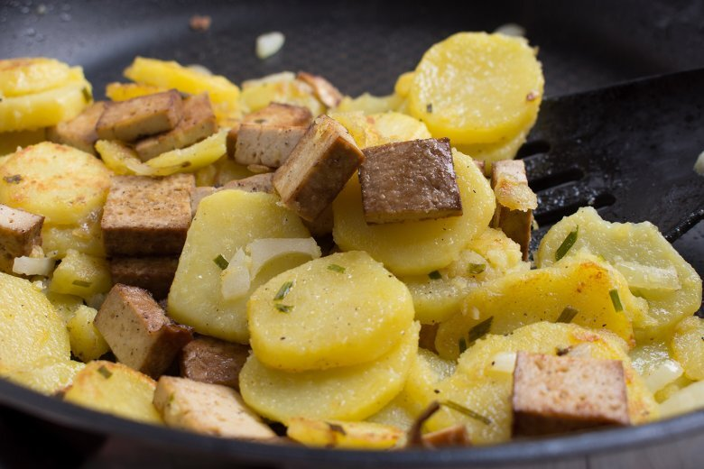

# cookbook
Das offizielle CrazyCoders Kochbuch ist eine Ansammlung von den Lieblingsrezepten der Schüler der Klasse FbW-WD21-D02-1 "CrazyCoders"

## Inhalt

1. [Ahmads Lieblingsrezepte]
2. [Alis Lieblingsrezepte](#alis-lieblingsrezepte)
3. [Camilas Lieblingsrezepte](#camilas-lieblingsrezepte)
4. [Farihas Lieblingsrezepte]
5. [Hamids Lieblingsrezepte]
6. [Houmans Lieblingsrezepte]
7. [Lászlós Lieblingsrezepte]
7. [Mahmuts Lieblingsrezepte]
8. [Mariannas Lieblingsrezepte]
9. [Mustaphas Lieblingsrezepte]
10. [Obadahs Lieblingsrezepte]
11. [Przemyslaws Lieblingsrezepte](#przemyslaws-lieblingsrezepte)
12. [Saeeds Lieblingsrezepte]
13. [Sidars Lieblingsrezepte]
14. [Soonams Lieblingsrezepte](#soonams-lieblingsrezepte)
15. [Tanjus Lieblingsrezepte]

---

# Ahmads Lieblingsrezepte

## Ahmads Lieblingsrezept aus der Heimat

## Ahmads Lieblingsrezept aus Deutschland


# Alis Lieblingsrezepte

## Alis Lieblingsrezept aus der Heimat

## MAKARONNI GERICHT


​
## ZUTATEN:
​
1. *15 g*	Proteinpulver **(Whey Vanille)**
2. _20 g	Erythrit **(Zuckerersatz)** (Xucker light)_
3. 120 ml	Hafermilch **(Haferdrink)**
4. 3 g	Backpulver
5. 1 EL	Chiasamen
6. 50 g	Reismehl
7.	Ei(er)
8.	_Banane_
​
## ZUBEREITUNG:

**Alle Zutaten in einem Standmixer vermengen.**
​
> Öl in einer Pfanne erhitzen und jeweils zwei Esslöffel     Teig für einen Pancake bei mittlerer Hitze braten.​

>  **Tipps:** Jede andere Pflanzenmilch ist möglich. Das Reismehl kann z. B. durch Haferflockenmehl ersetzt werden.

>  Nährwerte:
153 g Kohlenhydrate
16 g Fett
37 g Eiweiß

## Alis Lieblingsrezept aus Deutschland

## Entrecôte-Steak mit Rote-Bete-Sala


​
>  Für ein gutes Stück Fleisch muss man    nicht lange in der Küche stehen – das zarte Entrecôte-Steak mit Rote-Bete-Salat beweist es. Dazu servieren wir Rucola und Walnüsse.

### Zutaten:

- 1½ EL Olivenöl​
- (Entrecôte-Steaks à 220 g)
- Salz
- Pfeffer (frisch gemahlen)
- 125 Gramm Rote Bete (vorgekocht, aus dem Vakuumpack)
- ½ Knoblauchzehe
- 1½ EL Balsamessig
- Zucker
- 25 Gramm Rucola (Rauke)
- 1 EL Walnüsse (gemahlen)

### Zubereitung:

> Den Backofen auf 150 Grad, Umluft nicht empfehlenswert, Gas Stufe 1 vorheizen.
 1 EL Öl in einer Pfanne erhitzen. Steaks trocken tupfen, salzen, pfeffern und je Seite etwa ½ Minute scharf anbraten. Auf einem Blech im Ofen 8–10 Minuten fertig garen.
 Rote Bete abtropfen lassen und in Spalten schneiden. Knoblauch andrücken und schälen. 1–2 EL Öl in einer Pfanne erhitzen, Rote Bete und Knoblauch darin 3 Minuten braten. Essig und 2 Prisen Zucker zufügen, zugedeckt etwa 2 Minuten karamellisieren lassen.
 Steaks herausnehmen, fest in Backpapier wickeln, 5 Minuten ruhen lassen. Rauke verlesen, abspülen, trocknen. Mit Walnüssen, Roter Bete, restlichem Öl, Salz und Pfeffer mischen. Zu den Steaks servieren.

##  GUTEN APPETITE


# Camilas Lieblingsrezepte

## Camilas Lieblingsrezept aus der Heimat

## Käsebällchen (Aus Brasilien)

Auf Portugiesisch sagt man **Pão de queijo** *(etwas wie Pawn di Keisho)*​


```​
Arbeitszeit ca. 30 Minuten
Ruhezeit ca. 1 Stunde 
Koch-/Backzeit ca. 25 Minuten
Gesamtzeit ca. 1 Stunde 55 Minuten
```

### ZUTATEN:

- **1 kg** 	Tapioka (Mehl), oder, falls zu bekommen, Polvilho azedo
- **200 ml** 	Öl
- **500 g**	Käse, gerieben (Gemisch aus Parmesan und Gouda, mittelalt)
- **3** 	Ei(er), Größe M
- **400 ml** 	Milch
- **125 ml** 	Wasser
- **1 EL** 	Salz, gehäufter EL
​
### ZUBEREITUNG:

1. Wasser und Milch zusammen mit dem Öl und dem Salz in einem Topf zum Kochen bringen;​
2. Den Topf vom Herd nehmen und das Tapiokamehl nach und dazugeben und unterrühren; 
3. Die 3 Eier verquirlen und in den Teig gleiten lassen; 
4. Alles zu einem geschmeidigen Teig verarbeiten.
Zum Schluss den geriebenen Käse zufügen (man kann auch türkischen Kefalotery-Käse, oder Manchego oder Pecorino verwenden) und den Teig jetzt am besten mit den Händen bearbeiten und alles richtig verkneten; 
5. Diese mit etwas Abstand auf ein mit Backpapier ausgelegtes Backblech legen und für 20 - 25 Minuten auf der mittleren Schiene bei 180 - 200°C Umluft goldgelb backen.
Nach Ende der Backzeit sind sie von außen leicht knusprig und von innen herrlich weich. Diese besondere Konsistenz ist genau richtig.
​
```
Guten Appetit!
```

## Camilas Lieblingsrezept aus Deutschland


# Farihas Lieblingsrezepte

## Farihas Lieblingsrezept aus der Heimat

## Farihas Lieblingsrezept aus Deutschland


# Hamids Lieblingsrezepte

## Hamids Lieblingsrezept aus der Heimat

## Hamids Lieblingsrezept aus Deutschland


# Houmans Lieblingsrezepte

## Houmans Lieblingsrezept aus der Heimat

## Houmans Lieblingsrezept aus Deutschland


# Lászlós Lieblingsrezepte

## Lászlós Lieblingsrezept aus der Heimat

## Lászlós Lieblingsrezept aus Deutschland


# Mahmuts Lieblingsrezepte

## Mahmuts Lieblingsrezept aus der Heimat

## Mahmuts Lieblingsrezept aus Deutschland


# Mariannas Lieblingsrezepte

## Mariannas Lieblingsrezept aus der Heimat

## Mariannas Lieblingsrezept aus Deutschland


# Mustaphas Lieblingsrezepte

## Mustaphas Lieblingsrezept aus der Heimat

## Mustaphas Lieblingsrezept aus Deutschland


# Obadahs Lieblingsrezepte

## Obadahs Lieblingsrezept aus der Heimat

## Obadahs Lieblingsrezept aus Deutschland


# Przemyslaws Lieblingsrezepte

## Przemyslaws Lieblingsrezept aus der Heimat

## Rezept veganer Bigos


### Zutaten:

- 800 g Sauerkraut 
- 6 Stück Zwiebeln
- 200 g Tofu
- 2 Stk	Lorbeerblatt
- 10 ml Öl zum Anbraten
- 50 g getrocknete Pflaumen
- eine Paprika _rot oder grün_
- Pfeffer ganze Kugeln (nach belieben)
- 8 Kugeln Piment
- ein halbes Glas Rosienen 
- 200 g Sojafleisch  gewürfelt
- Sojasosse
- Salz

### Erster Schritt:

- Vorbereitung
    - Tofu in kleine Würfeln schneiden un anbraten
    - Sojafleisch mit heissem Wasser und etwas Sojasosse einweichen
    - Paprika würfeln
    - Sauerkraut vom Wasser trennen

### Zweiter Schritt:

- Alle Zutaten in einen Topf geben und so lange kochen bis das Sauerkraut weich ist
- zwischendurch das Wasser vom Sauerkraut nach belieben dazugeben

...

**Bitte heiß servieren**

[siehe auch ein Rezept mit Fleich](https://www.gutekueche.de/bigosch-rezept-2223)

<a href="https://www.gutekueche.de/bigosch-rezept-2223" target="_blank">siehe auch ein Rezept mit Fleich</a>

## Przemyslaws Lieblingsrezept aus Deutschland

## vegane Bratkartoffeln mit Räuchertofu
​


### Zutaten:

- 1	kg Kartoffeln, vorwiegend festkochend
- 2	Stk	Zwiebeln
- 200 g	Räuchertofu
- 5 EL Räuchertofu
- 5	EL Rapsöl
- 1	Prise Kräutersalz
- 1	Prise Pfeffer, frisch gemahlen

#### Rezept Zubereitung
​
1. Für die veganen Bratkartoffeln mit Räuchertofu zuerst die Kartoffeln in einem großen Topf mit Salzwasser für etwa 20 Minuten kochen.
2. Die Kartoffeln anschließend abseihen, pellen und in nicht zu feine Scheiben schneiden. Nun die Zwiebeln schälen und würfelig schneiden.
3. Den Räuchertofu abtropfen lassen, die restliche Flüssigkeit mit einem Küchenpapier abtupfen und auch den Tofu in Würfel schneiden.
3. Dann das Öl in einer großen Pfanne langsam erhitzen und die Zwiebelstücke darin für eine Minute glasig anschwitzen.
4. Nun den Tofu und die Kartoffeln dazugeben, für ca. 10 Minuten knusprig braten und mit Kräutersalz und Pfeffer abschmecken.
​
---
​
**_Lecker_**


# Saeeds Lieblingsrezepte

## Saeeds Lieblingsrezept aus der Heimat

## Saeeds Lieblingsrezept aus Deutschland


# Sidars Lieblingsrezepte

## Sidars Lieblingsrezept aus der Heimat

## Sidars Lieblingsrezept aus Deutschland


# Soonams Lieblingsrezepte

## Soonams Lieblingsrezept aus der Heimat

## Bibimbap

**Bibimbap ist ein beliebtes koreanisches Gericht, das mit Reis und verschiedenen Gemüsesorten, etwas Rindfleisch oder Tofu, einem rohen oder gebratenen Ei und Gochujang zubereitet wird. Als klassisches Resteessen gibt es kaum Einschränkungen bei der Wahl der Zutaten und unzählige Variationen.**

### Zutaten:

1. 400g Reis
2. 12 getrocknete
3. 400g Sushi Reis
4. 12 getrocknete Shiitake Pilze
5. 4 Mu-Err Pilze, getrocknet
6. 2 Handvoll Babyspinat
7. 100g Mungbohnensprossen
8. 2 Karotten
9. 1 Zucchini
10. 2 Knoblauchzehen
11. 4 EL Öl zum Braten
12. 4 EL Helle Sojasauce
13. 1 EL geröstetes Sesamöl
14. 4 Eier
15. 2 EL koreanische Chilipaste, Gochujang

[Dies ist ein Link zum Rezept](https://asiastreetfood.com/rezept/bibimbap-rezept-korea/"asiastreetfood")

```
Klick unten, um das Video zu starten
```

[](http://www.youtube.com/watch?v=JvBGHNxyLHo)

> **"Bibimbab geht immer!"**

## Soonams Lieblingsrezept aus Deutschland

## Currywurst

**Currywurst ist sehr lecker**

### So bereitet man Currywurst zu

Die kleingeschnittenen Zwiebeln in Olivenöl glasig dünsten. Etwas Tomatenmark dazugeben und mit etwas Wasser ablöschen. Ketchup, Essig und Honig dazugeben und bei kleiner Hitze leicht köcheln lassen. Der Essig darf nicht zu schnell verdampfen. Dann die Sojasauce und die anderen Gewürze dazugeben. Gut umrühren, ggf. noch etwas Wasser dazugeben. Abschmecken, ob noch etwas Curry oder Chili dazu soll.


> "Die Zeiten ändern sich, nur die Currywurst nicht"


# Tanjus Lieblingsrezepte

## Tanjus Lieblingsrezept aus der Heimat

## Tanjus Lieblingsrezept aus Deutschland
