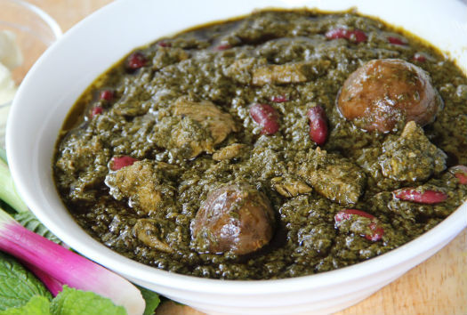

# cookbook
Das offizielle CrazyCoders Kochbuch ist eine Ansammlung von den Lieblingsrezepten der Schüler der Klasse FbW-WD21-D02-1 "CrazyCoders"

## Inhalt

1. [Ahmads Lieblingsrezepte]
2. [Alis Lieblingsrezepte](#alis-lieblingsrezepte)
3. [Camilas Lieblingsrezepte](#camilas-lieblingsrezepte)
4. [Farihas Lieblingsrezepte](#farihas-lieblingsrezepte)
5. [Hamids Lieblingsrezepte]
6. [Houmans Lieblingsrezepte]
7. [Lászlós Lieblingsrezepte]
7. [Mahmuts Lieblingsrezepte]
8. [Mariannas Lieblingsrezepte](#mariannas-lieblingsrezepte)
9. [Mustaphas Lieblingsrezepte](#mustaphas-lieblingsrezepte)
10. [Obadahs Lieblingsrezepte]
11. [Przemyslaws Lieblingsrezepte](#przemyslaws-lieblingsrezepte)
12. [Saeeds Lieblingsrezepte](#saeeds-lieblingsrezepte)
13. [Sidars Lieblingsrezepte]
14. [Soonams Lieblingsrezepte](#soonams-lieblingsrezepte)
15. [Tanjus Lieblingsrezepte]

---

# Ahmads Lieblingsrezepte

## Ahmads Lieblingsrezept aus der Heimat


## Ahmads Lieblingsrezept aus Deutschland


# Alis Lieblingsrezepte

## Alis Lieblingsrezept aus der Heimat

## MAKARONNI GERICHT


​
## ZUTATEN:
​
1. *15 g*	Proteinpulver **(Whey Vanille)**
2. _20 g	Erythrit **(Zuckerersatz)** (Xucker light)_
3. 120 ml	Hafermilch **(Haferdrink)**
4. 3 g	Backpulver
5. 1 EL	Chiasamen
6. 50 g	Reismehl
7.	Ei(er)
8.	_Banane_
​
## ZUBEREITUNG:

**Alle Zutaten in einem Standmixer vermengen.**
​
> Öl in einer Pfanne erhitzen und jeweils zwei Esslöffel     Teig für einen Pancake bei mittlerer Hitze braten.​

>  **Tipps:** Jede andere Pflanzenmilch ist möglich. Das Reismehl kann z. B. durch Haferflockenmehl ersetzt werden.

>  Nährwerte:
153 g Kohlenhydrate
16 g Fett
37 g Eiweiß

## Alis Lieblingsrezept aus Deutschland

## Entrecôte-Steak mit Rote-Bete-Sala


​
>  Für ein gutes Stück Fleisch muss man    nicht lange in der Küche stehen – das zarte Entrecôte-Steak mit Rote-Bete-Salat beweist es. Dazu servieren wir Rucola und Walnüsse.

### Zutaten:

- 1½ EL Olivenöl​
- (Entrecôte-Steaks à 220 g)
- Salz
- Pfeffer (frisch gemahlen)
- 125 Gramm Rote Bete (vorgekocht, aus dem Vakuumpack)
- ½ Knoblauchzehe
- 1½ EL Balsamessig
- Zucker
- 25 Gramm Rucola (Rauke)
- 1 EL Walnüsse (gemahlen)

### Zubereitung:

> Den Backofen auf 150 Grad, Umluft nicht empfehlenswert, Gas Stufe 1 vorheizen.
 1 EL Öl in einer Pfanne erhitzen. Steaks trocken tupfen, salzen, pfeffern und je Seite etwa ½ Minute scharf anbraten. Auf einem Blech im Ofen 8–10 Minuten fertig garen.
 Rote Bete abtropfen lassen und in Spalten schneiden. Knoblauch andrücken und schälen. 1–2 EL Öl in einer Pfanne erhitzen, Rote Bete und Knoblauch darin 3 Minuten braten. Essig und 2 Prisen Zucker zufügen, zugedeckt etwa 2 Minuten karamellisieren lassen.
 Steaks herausnehmen, fest in Backpapier wickeln, 5 Minuten ruhen lassen. Rauke verlesen, abspülen, trocknen. Mit Walnüssen, Roter Bete, restlichem Öl, Salz und Pfeffer mischen. Zu den Steaks servieren.

##  GUTEN APPETITE


# Camilas Lieblingsrezepte

pommes

## Camilas Lieblingsrezept aus der Heimat

## Käsebällchen (Aus Brasilien)

Auf Portugiesisch sagt man **Pão de queijo** *(etwas wie Pawn di Keisho)*​


```​
Arbeitszeit ca. 30 Minuten
Ruhezeit ca. 1 Stunde 
Koch-/Backzeit ca. 25 Minuten
Gesamtzeit ca. 1 Stunde 55 Minuten
```

### ZUTATEN:

- **1 kg** 	Tapioka (Mehl), oder, falls zu bekommen, Polvilho azedo
- **200 ml** 	Öl
- **500 g**	Käse, gerieben (Gemisch aus Parmesan und Gouda, mittelalt)
- **3** 	Ei(er), Größe M
- **400 ml** 	Milch
- **125 ml** 	Wasser
- **1 EL** 	Salz, gehäufter EL
​
### ZUBEREITUNG:

1. Wasser und Milch zusammen mit dem Öl und dem Salz in einem Topf zum Kochen bringen;​
2. Den Topf vom Herd nehmen und das Tapiokamehl nach und dazugeben und unterrühren; 
3. Die 3 Eier verquirlen und in den Teig gleiten lassen; 
4. Alles zu einem geschmeidigen Teig verarbeiten.
Zum Schluss den geriebenen Käse zufügen (man kann auch türkischen Kefalotery-Käse, oder Manchego oder Pecorino verwenden) und den Teig jetzt am besten mit den Händen bearbeiten und alles richtig verkneten; 
5. Diese mit etwas Abstand auf ein mit Backpapier ausgelegtes Backblech legen und für 20 - 25 Minuten auf der mittleren Schiene bei 180 - 200°C Umluft goldgelb backen.
Nach Ende der Backzeit sind sie von außen leicht knusprig und von innen herrlich weich. Diese besondere Konsistenz ist genau richtig.
​
```
Guten Appetit!
```

## Camilas Lieblingsrezept aus Deutschland


# Farihas Lieblingsrezepte

## Farihas Lieblingsrezept aus der Heimat

## Kabuli Palau


**Das Rezept**

**_Zutaten für 5 Personen_**

- Basmati-Reis        500 g
- Lammkeule           1 kg
- Zwiebeln            200 g
- Kardamom gemahlen   0,5 TL 
- Pfeffer             0,5 TL
- Garam-Masala        1 TL
- Salz                2 TL
- Wasser              750 ml
- Öl                  120 ml
- Rosinen             100 g
- Karotten            500 g
- Mandelstifte        100 g
- Zucker              2 TL

**_Zubereitung_ (Gesamtzeit 2 Std.)**

1. Reis mit kaltem Wasser bedeckt 1-2 Stunden quellen lassen. Fleisch parieren und in ca. 5 cm große Würfel schneiden. Kardamom, Pfeffer, Garam Masala und Salz in dem warmen Wasser verrühren.
2. Die Zwiebeln in der Hälfte des Öles unter Rühren anbraten. Dann das Fleisch dazugeben und rundum kräftig anbraten.
3. Mit der Gewürzmischung ablöschen, aufkochen und bei mittlerer Hitze eine Stunde zugedeckt garen. Dabei immer wieder abschäumen.
4. Die Karotten putzen, längs in dünne Scheiben, dann in schmale Streifen schneiden.
5. Das restliche Öl erhitzen, dann die Rosinen unter ständigem Rühren darin so lange erhitzen, bis sie prall und rund geworden sind. Die Rosinen herausheben und auf einen großen Teller geben.
6. Im selben Öl die Karottenstreifen mit dem Zucker unter Rühren 3-4 Minuten anbraten, herausnehmen und ebenfalls auf den Teller geben. Zuletzt die Mandeln kurz rösten und auf den Teller geben.
7. Das Fleisch aus der Brühe heben und zugedeckt warmhalten. Die Brühe durch ein feines Sieb in einen großen Topf gießen und aufkochen.
8. Den abgetropften Reis hineingeben und bei mittlerer Hitze zugedeckt so lange garen, bis die Brühe aufgesogen ist (der Reis fängt dann an leise zu knistern).
9. Mit dem Stiel eines Kochlöffels mehrere "Kamine" in den Reis drücken, so dass der Dampf entweichen kann.
10. Das Fleisch, die Rosinen, die Karotten und die Mandelmischung nebeneinander auf den Reis setzen.
11. Topfdeckel mit einem Küchentuch umwickeln, Topf damit zudecken. Bei sehr niedriger Temperatur weitere 20-30 Minuten erhitzen.
12. Sowohl die Rosinen, als auch Karotten und die Mandelmischung aus dem Topf heben. Die Fleischstücke auf eine große, vorgewärmte Servierplatte legen und mit dem Reis bedecken.
13. Die Rosinen, die Mandelmischung und die Karottenstreifen darüber streuen und servieren.

---

_Hier noch ein Video wie man Kabuli Palau kocht._

[](http://www.youtube.com/watch?v=UqK_ox7FF00)

_Guten Apetit!_

Auf afghanisch: _Ishtiyahe khub!_ 

## Farihas Lieblingsrezept aus Deutschland

## Klassische Kohlrouladen


---

**Das Rezept**

**_Zutaten für 6 Personen_**

- Weißkohl (ca. 1,2 kg)               1
- Kümmelsaat Salz                     2 EL
- Brötchen (altbacken, ca. 40 g)      1
- Zwiebel (ca. 90 g)                  1
- Hackfleisch                         500 g
- Ei (Kl. M)                          1
- Kümmel (gemahlen)                   1 TL
- Pfeffer                             1 TL
- Öl                                  8 EL
- Tomatenmark                         1 EL
- Speisestärke                        3 EL

***

**_Zubereitung_ (Gesamtzeit 4 Std.)**

1. Vom Kohl die äußeren Blätter entfernen, Strunk keilförmig herausschneiden. Kohl und Kümmelsaat in einen großen Topf mit reichlich Salzwasser geben, zugedeckt aufkochen und bei milder Hitze ca. 20 Minuten ziehen lassen. Geben Sie mindestens 3 Liter Wasser zum Kohl, so ist er beim Garziehen komplett bedeckt, und es bleibt genügend Wasser für den Saucenansatz. Kohl mit einer Schaumkelle aus dem Wasser heben und ca. 10 Minuten abkühlen lassen. Kochwasser durch ein Sieb gießen, auffangen und beiseitestellen.
2. nzwischen für die Füllung Brötchen in Wasser einweichen, bis es komplett vollgesogen ist. Zwiebel in sehr feine Würfel schneiden. Brötchen gut ausdrücken. Hackfleisch mit Brötchen, Zwiebeln, Ei und gemahlenem Kümmel verkneten, mit Salz und Pfeffer würzen, beiseitestellen.
3. Vom Kohl vorsichtig 12 große Blätter ablösen, auf einem Küchentuch abtropfen lassen und mit Küchenpapier trocken tupfen. Anhaftende Kümmelsaat vorsichtig entfernen. Dicke Mittelrippen aus den Blättern herausschneiden. Je 2 Blätter leicht überlappend aneinanderlegen. Ein Blatt sollte mit dem oberen Rand 2-3 cm breit auf dem unteren Rand des anderen Blattes liegen, damit sich die Füllung gut darin einrollen lässt. Restlichen Kohl beiseitelegen.
4. Hackmasse in 6 Portionen teilen, je 1 Portion mittig aufs untere Drittel der Kohlblätter setzen, dabei seitlich jeweils etwas Platz lassen. Kohl von unten über die Füllung klappen, dann die Seiten über die Füllung klappen und die Blätter von unten aufrollen. Kohlrouladen über Kreuz mit Küchengarn zusammenbinden.
5. 3-4 El Öl in einer großen Pfanne erhitzen, Kohlrouladen darin pro Seite je 4-5 Minuten bei mittlerer Hitze braun anbraten. Rouladen aus der Pfanne nehmen und in einen Bräter legen. Bratensatz in der Pfanne mit 500 ml Kochwasser vom Kohl ablöschen, 2 Minuten bei milder Hitze kochen lassen und zu den Rouladen in die Auflaufform gießen. Es sollte genügend Flüssigkeit in der Auflaufform sein, damit die Rouladen während des Garens nicht trocken werden. Kohlrouladen im vorgeheizten Backofen bei 180 Grad (Gas 2-3, Umluft 160) 2-2:30 Stunden schmoren, dabei alle 30 Minuten wenden.
6.  Für die Sauce den restlichen Kohl in ca. 3 cm große Stücke schneiden, in 3-4 El Öl dunkelbraun anbraten und mit Pfeffer würzen. Tomatenmark zugeben und 2-3 Minuten mitbraten. Mit 1,5 l Kochwasser vom Kohl auffüllen und ca. 1 Stunde bei milder bis mittlerer Hitze einkochen lassen. (Auf die Weise ergibt sich ca. 1 l Saucenansatz.)
7. Kohlrouladen aus der Auflaufform nehmen und auf einem Teller beiseitestellen. Bratenfond aus der Auflaufform zum Saucenansatz gießen. Saucenansatz durch ein Sieb in einen Topf gießen, durchdrücken und gut abtropfen lassen. Sauce aufkochen und mit in etwas kaltem Wasser angerührter Stärke abbinden. Kohlrouladen in der Sauce nochmals erwärmen, dann auf Tellern verteilen, 3-4 El Sauce darübergeben. Dazu passen Petersilienkartoffeln.

---

_Hier noch ein Video wie man die Kohlroueladen macht._

[](http://www.youtube.com/watch?v=0EzttZ4vM10)

_Guten Apetit!_


# Hamids Lieblingsrezepte

## Hamids Lieblingsrezept aus der Heimat

## Hamids Lieblingsrezept aus Deutschland


# Houmans Lieblingsrezepte

## Houmans Lieblingsrezept aus der Heimat

## Houmans Lieblingsrezept aus Deutschland


# Lászlós Lieblingsrezepte

## Lászlós Lieblingsrezept aus der Heimat

## Lászlós Lieblingsrezept aus Deutschland


# Mahmuts Lieblingsrezepte

## Mahmuts Lieblingsrezept aus der Heimat

## Mahmuts Lieblingsrezept aus Deutschland


# Mariannas Lieblingsrezepte

## Mariannas Lieblingsrezept aus der Heimat

## Piroggen mit Fleischfüllung

## Zutaten

- 500 g Rinderhackfleisch
- 1 EL Koriander (trocken)
- 1 EL Zucker
- 2 TL Salz
- 2 St. Eigelb
- 120 ml Milch
- 550 g Mehl
- 10 g Hefe (trocken)
- 500 ml Pflanzenöl
- 
## Zubereitung

1. In warme Milch hinzufügen: Salz, Zucker, Trockenhefe. Umrühren. 100 g Mehl dazugeben, umrühren und 20 min. lang bedeckt mit einem sauberen Handtuch an einem warmen Ort stehen lassen.
2. In den Sauerteig langsam das restliche Mehl hinzufügen. Teig anrühren. 2 Eigelbe hinzufügen und umrühren. 40 ml Pflanzenöl hinzufügen. Teig zu einer Kugel rollen. 30 Minuten lang stehen lassen.
3. Hackfleisch, Salz und Koriander vermischen. Teig ausrollen und zu einer Wurst formen. In gleich große Segmente aufteilen. Teigsegmente ausrollen, Hackmischung hineinlegen.
4. Piroggenteig verschließen. Piroggen so formen, dass diese nicht aufgeht.
5. Öl in die Pfanne geben. Piroggen ins Öl legen. Von jeder Seite 2 Min. lang braten. Piroggen von allen Seiten durchbraten. Servieren.

## Mariannas Lieblingsrezept aus Deutschland


# Mustaphas Lieblingsrezepte

## Mustaphas Lieblingsrezept aus der Heimat

## Mustaphas Lieblingsrezept aus Deutschland

Fruchtiger Rotkohl mit Portwein

---


## Zutaten für

> - 1,2 kg 	Rotkohl, geputzt und in feine Streifen geschnitten
> - 1 	Zitrone(n)
> - Salz und Pfeffer aus der Mühle
> - 50 g 	Zucker
> - ¼ Liter 	Rotwein, trocken, kräftig
> - etwas 	Essig (Rotweinessig)
> - ¼ Liter 	Portwein
> - 100 g 	Schmalz (Gänseschmalz)
> - 2 	Zwiebel(n), fein gewürfelt
> - 30 g 	Honig (Akazienhonig)
> - 3 	Orange(n), ausgepresst
> - 100 g 	Preiselbeeren aus dem Glas
> -  1 	Apfel, geschält, in 8-12 Segmente geteilt und diese in Scheibchen geschnitten

## Zubereitung

- Den Rotkohl leicht salzen, mit dem Saft einer Zitrone beträufeln und gut durchmischen. Dadurch wird er schön rot.
- Den Zucker bei nicht zu starker Hitze goldgelb karamellisieren lassen und mit Essig, Rotwein und Portwein ablöschen. Das Gänseschmalz zufügen, die Flüssigkeit etwas einkochen lassen und die Zwiebelwürfel hineingeben. Mit Salz, Pfeffer und Honig würzen und die Flüssigkeit erneut einkochen lassen.
- Orangensaft, Rotkohl, Preiselbeeren und den Apfel zufügen und alles zugedeckt bei mittlerer Hitze weich dünsten, das dauert 40 - 60 Minuten, hängt vom Rotkohl ab. Dabei öfter umrühren und immer wieder probieren ob der Rotkohl schon gar ist, zum Schluss noch einmal abschmecken.
- Den Rotkohl vor dem Servieren noch neben dem Herd ein paar Minuten nachziehen lassen. 


# Obadahs Lieblingsrezepte

## Obadahs Lieblingsrezept aus der Heimat

## Obadahs Lieblingsrezept aus Deutschland


# Przemyslaws Lieblingsrezepte

## Przemyslaws Lieblingsrezept aus der Heimat

## Rezept veganer Bigos


### Zutaten:

- 800 g Sauerkraut 
- 6 Stück Zwiebeln
- 200 g Tofu
- 2 Stk	Lorbeerblatt
- 10 ml Öl zum Anbraten
- 50 g getrocknete Pflaumen
- eine Paprika _rot oder grün_
- Pfeffer ganze Kugeln (nach belieben)
- 8 Kugeln Piment
- ein halbes Glas Rosienen 
- 200 g Sojafleisch  gewürfelt
- Sojasosse
- Salz

### Erster Schritt:

- Vorbereitung
    - Tofu in kleine Würfeln schneiden un anbraten
    - Sojafleisch mit heissem Wasser und etwas Sojasosse einweichen
    - Paprika würfeln
    - Sauerkraut vom Wasser trennen

### Zweiter Schritt:

- Alle Zutaten in einen Topf geben und so lange kochen bis das Sauerkraut weich ist
- zwischendurch das Wasser vom Sauerkraut nach belieben dazugeben

...

**Bitte heiß servieren**

[siehe auch ein Rezept mit Fleisch](https://www.gutekueche.de/bigosch-rezept-2223)

<a href="https://www.gutekueche.de/bigosch-rezept-2223" target="_blank">siehe auch ein Rezept mit Fleich</a>

## Przemyslaws Lieblingsrezept aus Deutschland

## vegane Bratkartoffeln mit Räuchertofu


### Zutaten:

- 1	kg Kartoffeln, vorwiegend festkochend
- 2	Stk	Zwiebeln
- 200 g	Räuchertofu
- 5 EL Räuchertofu
- 5	EL Rapsöl
- 1	Prise Kräutersalz
- 1	Prise Pfeffer, frisch gemahlen

#### Rezept Zubereitung

1. Für die veganen Bratkartoffeln mit Räuchertofu zuerst die Kartoffeln in einem großen Topf mit Salzwasser für etwa 20 Minuten kochen.
2. Die Kartoffeln anschließend abseihen, pellen und in nicht zu feine Scheiben schneiden. Nun die Zwiebeln schälen und würfelig schneiden.
3. Den Räuchertofu abtropfen lassen, die restliche Flüssigkeit mit einem Küchenpapier abtupfen und auch den Tofu in Würfel schneiden.
3. Dann das Öl in einer großen Pfanne langsam erhitzen und die Zwiebelstücke darin für eine Minute glasig anschwitzen.
4. Nun den Tofu und die Kartoffeln dazugeben, für ca. 10 Minuten knusprig braten und mit Kräutersalz und Pfeffer abschmecken.

---

**_Lecker_**


# Saeeds Lieblingsrezepte

## Saeeds Lieblingsrezept aus der Heimat

## Ghorme Sabzi

**Zutaten**

- 1 kg Lammkeule
- 30 g Butterschmalz
- 300 g rote Zwiebeln
- 1 EL Kurkuma (gehäuft)
- 100 g Petersilie
- 50 g Koriander
- 50 g Schnittlauch
-  150 g Blattspinat
- 2 EL Bockshornkleeblätter bestellen*
- 1 Stange Lauch
- 1 Bund Frühlingszwiebeln
- 1 Liter Wasser
- 400 g Fava Bohnen aus der Dose bestellen*
- 6 getrocknete Limetten bestellen*
- 2 bis 3 TL Salz
- 1/2 TL Pfeffer schwarz
    
**Für den persischen Reis:**

- 250 g Basmati Reis
- 2 TL Salz
- 2 Liter Wasser
- 1 TL Safranfädem

**Zubereitung**

1. Zuerst das Fleisch waschen, mit Küchenpapier trocken tupfen und in ca. 2 cm große Würfel schneiden. Zwiebel sowie Knoblauch schälen und fein hacken.
2. Nun 25 ml Ghee zusammen mit den Zwiebel- und Knoblauchstücken in einen Topf geben und mit Kurkuma bestreuen.
3. Danach die Fleischstücke hinzufügen und bei starker Hitze von allen Seiten gut anbraten - dabei immer wieder rühren.
4. Anschließend mit dem Wasser aufgießen, sodass die Zutaten nicht ganz mit Wasser bedeckt sind und für ca. 45 Minuten schmoren lassen.
5. Ghormeh Sabzi Kräutermischung sowie Bockshornkleeblätter in eine Schüssel geben, mit etwas Wasser übergießen und einweichen lassen.
6. Schnittlauch waschen, trocken schütteln und in feine Röllchen schneiden. Petersilie und Koriander ebenso waschen, trocken schütteln, die Blätter abzupfen und fein hacken. Frühlingszwiebel putzen, in Ringe schneiden und anschließend waschen. Spinat waschen, verlesen und klein schneiden.
7. Die Bohnen in einem Sieb abtropfen lassen.
8. Nun in einer separaten Pfanne eingeweichte Kräuter, Schnittlauch, Petersilie, Koriander, Frühlingszwiebeln und Spinat mit 25 ml Ghee anbraten bis alles zusammenfällt und anschließend mit den Bohnen und dem Lorbeerblatt in den Topf mit dem Fleisch geben.
9. Die Limetten mehrmals einstechen, ebenso in den Topf geben und für weitere 60 Minuten zugedeckt schmoren lassen.
10. Zum Schluss den Eintopf mit Salz und Pfeffer abschmecken und servieren.

**TIPPS ZUM REZEPT!**

Ghormeh Sabzi mit normalen Reis oder Safranreis servieren. Das persische Gericht schmeckt am nächsten Tag noch besser.



## Saeeds Lieblingsrezept aus Deutschland

## Kürbissuppe

**Zutaten**

Für 4 Portionen

- 1   Hokkaido-Kürbis (ca. 800 g)
- 1   Zwiebel
- 1   Knoblauchzehe
- 2 EL   Butter
- 1 l   Gemüsebrühe
- Salz
- Pfeffer
- 100 ml   Schlagsahne
- etwas Petersilie und Chiliflocken zum Garnieren

**Zubereitung**

(35 Minuten)

ganz einfach

1. Kürbis halbieren, vierteln und die Kerne mit einem Esslöffel herausschaben. Kürbis waschen, trocken tupfen und in Stücke schneiden. Zwiebel schälen und würfeln. Knoblauch schälen und hacken.
2. Butter in einem Topf schmelzen. Zwiebel und Knoblauch darin glasig dünsten. Kürbis zufügen und kurz mitdünsten. Mit Brühe ablöschen und mit Salz und Pfeffer würzen. Zugedeckt bei milder Hitze ca. 15 Minuten köcheln lassen.
3. Ca. 3/4 der Sahne zufügen und alles fein pürieren. Noch einmal abschmecken. Kürbissuppe mit Rest Sahne und nach Belieben mit Pfeffer, gehackter Petersilie und Chiliflocken anrichten und servieren.
4. Tipp: Kürbissuppe einfrieren! Dafür die abgekühlte Suppe in Gefrierdosen oder Gefrierbeutel geben, fest verschließen und ins Tiefkühlfach legen. Zum Auftauen einige Stunden vor dem Aufwärmen in den Kühlschrank stellen.


# Sidars Lieblingsrezepte

## Sidars Lieblingsrezept aus der Heimat

## Sidars Lieblingsrezept aus Deutschland


# Soonams Lieblingsrezepte

## Soonams Lieblingsrezept aus der Heimat

## Bibimbap

**Bibimbap ist ein beliebtes koreanisches Gericht, das mit Reis und verschiedenen Gemüsesorten, etwas Rindfleisch oder Tofu, einem rohen oder gebratenen Ei und Gochujang zubereitet wird. Als klassisches Resteessen gibt es kaum Einschränkungen bei der Wahl der Zutaten und unzählige Variationen.**

### Zutaten:

1. 400g Reis
2. 12 getrocknete
3. 400g Sushi Reis
4. 12 getrocknete Shiitake Pilze
5. 4 Mu-Err Pilze, getrocknet
6. 2 Handvoll Babyspinat
7. 100g Mungbohnensprossen
8. 2 Karotten
9. 1 Zucchini
10. 2 Knoblauchzehen
11. 4 EL Öl zum Braten
12. 4 EL Helle Sojasauce
13. 1 EL geröstetes Sesamöl
14. 4 Eier
15. 2 EL koreanische Chilipaste, Gochujang

[Dies ist ein Link zum Rezept](https://asiastreetfood.com/rezept/bibimbap-rezept-korea/"asiastreetfood")

```
Klick unten, um das Video zu starten
```

[](http://www.youtube.com/watch?v=JvBGHNxyLHo)

> **"Bibimbab geht immer!"**

## Soonams Lieblingsrezept aus Deutschland

## Currywurst

**Currywurst ist sehr lecker**

### So bereitet man Currywurst zu

Die kleingeschnittenen Zwiebeln in Olivenöl glasig dünsten. Etwas Tomatenmark dazugeben und mit etwas Wasser ablöschen. Ketchup, Essig und Honig dazugeben und bei kleiner Hitze leicht köcheln lassen. Der Essig darf nicht zu schnell verdampfen. Dann die Sojasauce und die anderen Gewürze dazugeben. Gut umrühren, ggf. noch etwas Wasser dazugeben. Abschmecken, ob noch etwas Curry oder Chili dazu soll.


> "Die Zeiten ändern sich, nur die Currywurst nicht"


# Tanjus Lieblingsrezepte

## Tanjus Lieblingsrezept aus der Heimat

## Tanjus Lieblingsrezept aus Deutschland
